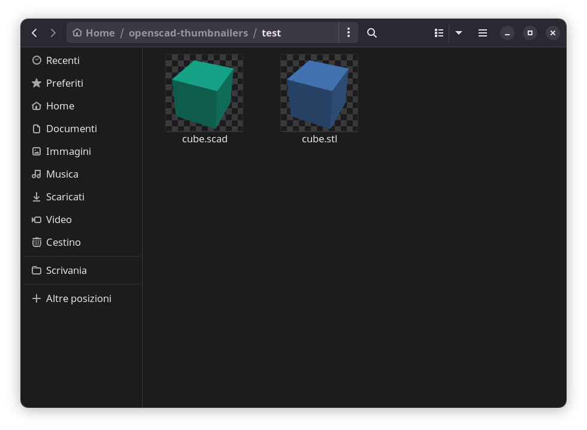

# Openscad thumbnailers



This project allows most GTK file managers (Nautilus, Nemo, Caja and PCManFM-gtk) to show thumbnails for `.stl` and `.scad` files.

It also **works with Nautilus>=3.28**, which introduced thumbnailers sandboxing with bubblewrap.

## Requirements

 * openscad
 * imagemagick
 * Xvfb
 
 In Fedora they can be installed with the following command:
 
 ```bash
 sudo dnf install openscad ImageMagick xorg-x11-server-Xvfb
 ```

## Installation

To install the thumbnailern a terminal into this directory and execute:

```bash
sudo bash install.sh
```

After that clean the old thumbnails and restart nautilus

```bash
rm -r ~/.cache/thumbnails
nautilus -q
```
